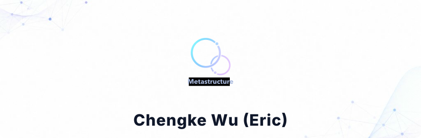

<div align="center">
  <a href="https://knowhereto.ai">
    
  </a>
  <br><br>
  <a href="https://scholar.google.com.au/citations?user=DzwZYrQAAAAJ&hl=zh-CN">
    
  </a>
  <a href="mailto:blackorangekk@gmail.com">
    
  </a>
</div>

<br>

> **Founder & CTO**, *Meta Structure Co., Ltd* · **Associate Professor** @ *Shenzhen Institutes of Advanced Technology (SIAT), Chinese Academy of Sciences (CAS)*  
> 🎓 Ph.D. in AI & Engineering, *Curtin University, Australia* | B.Eng & M.Eng, *Chongqing University*

---

### 🚀 `<sys.profile>`

I am an AI System Architect and Researcher operating at the intersection of **Agentic Retrieval-Augmented Generation (RAG)**, **Multimodal Large Language Models (LLMs)**, and **Knowledge Graphs (KG)**. I specialize in designing fault-tolerant, budget-aware autonomous agents capable of structuring highly noisy, real-world data (PDFs, DOCX, images) into actionable intelligence.

If it involves parsing the unparsable, extracting the invisible, or orchestrating multi-agent systems to solve domain-specific engineering challenges—I'm building it.

---

### 💻 `<tech.stack>`

<p align="center">
  
  <br>
  <i><b>Core:</b> Python, PyTorch, LangChain, Celery, Llama, DeepSeek, Claude <br>
  <b>Databases/Graph:</b> Neo4j, PostgreSQL, Qdrant</i>
</p>

---

### 🏆 `<system.achievements>`

* `[2026]` 🥇 **1st Prize (Knowhere AI)** - *National AI Application Scenario Innovation Challenge*, CAAI
* `[2026]` 🏆 **Grand Prize (Snap-Fill)** - *1st AI Agent Global Special Competition*, CAAI
* `[2025]` 🏆 **Grand Prize (Knowhere AI)** - *1st Tsinghua Innovation & Entrepreneurship Competition*
* `[2025]` 🥇 **1st Prize (Knowhere AI)** - *Intel AI Innovation Application Competition*
* `[2025.08]` 🥇 **1st Place** - *Alibaba Tianchi Document End-to-End Structured IE* (1/406)
* `[2022]` 🥈 **2nd Prize** - *Global Construction Innovation Award*, Hong Kong CIC
* `[2022]` ⭐ **Outstanding Young Researcher Award** - *Chinese Academy of Sciences*
* `[2023.01]` 💼 **Principal Investigator** - *NSFC Youth Fund* (2023–2025)

---

### 🧠 `<research.outputs>`

My research focuses on deep learning, ontology, and LLM-driven decision-making in complex environments (e.g., AEC - Architecture, Engineering, and Construction). **66** publications · **h-index 25** · **5** ESI highly cited / hot papers.

**Selected Core Papers (First/Corresponding Author):**
* `[Advanced Engineering Informatics 2025]` *Retrieval augmented generation-driven information retrieval and question answering in construction management* (**ESI Highly Cited**, JCR Q1, CCF-B, IF 11.5)
* `[Knowledge-Based Systems 2023]` *Knowledge graph-enabled adaptive work packaging approach in modular construction* (JCR Q1, IF 8.0)
* `[Computer-Aided Civil and Infrastructure Engineering 2022]` *Graph based deep learning model for knowledge base completion in constraint management of construction projects* (JCR Q1, IF 9.9)
* `[Automation in Construction 2021]` *Hybrid deep learning model for automating constraint modelling in advanced work packaging* (JCR Q1, IF 12.6)
* `[Automation in Construction 2020]` *Ontological knowledge base for concrete bridge rehabilitation project management* (**ESI Highly Cited**, JCR Q1, IF 12.6)

> 🔗 *For a complete list of publications, citations, and patents, please query my [Google Scholar](https://scholar.google.com.au/citations?user=DzwZYrQAAAAJ&hl=zh-CN).*

---

### 🔬 `<current_processes>`

```yaml
threads:
  - id: 0x01
    status: "ACTIVE"
    task: "Meta Structure / Knowhere (Open Source): A unified Agentic RAG pipeline with dynamic WorkflowOrchestrator and precise hierarchical context rendering."
  - id: 0x02
    status: "ACTIVE"
    task: "Snap-fill Ecosystem (Local): Production-grade document intelligence platform featuring Term-First + Fallback retrieval and Lineage-Based Protection."
  - id: 0x03
    status: "ACTIVE"
    task: "Hierarchy-as-Harness: Researching the use of explicit document hierarchies as an action and evidence scaffold for budget-constrained agents, outperforming Flat-ReAct."
  - id: 0x04
    status: "ACTIVE"
    task: "What and Where (SCD Table Analysis): Investigating spatial cognitive dissonance in LLMs parsing complex tables, demonstrating multi-target interference drives displacement errors."
  - id: 0x05
    status: "ACTIVE"
    task: "WWW 2026 Research (T-Fus / Tree_RAG): Developing incremental fragmented knowledge fusion in RAG via top-down tree structuring."
```

---

### 💼 `<selected.enterprise.cases>`

#### Maia — Agent for engineering management teams · ~$150K
**CR Construction Co., Ltd.** · 2025–2026

Worked with department heads and the digital transformation lead to map workflows and AI opportunities across engineering, procurement, finance, admin, and HR. Delivered trilingual professional translation, automated report generation, and form automation modules, plus GUI-agent and RPA automation for data entry, export, and verification.

https://github.com/user-attachments/assets/ac95face-50b0-4dd6-b363-37d71ee18711

#### Eleven’th Think Tank · ~$100K
**Shaanxi Construction Engineering No. 11 Construction Group Co., Ltd.** · 2025

Worked with department heads and the chief engineer to map workflows and data across headquarters and project-site teams. Built 10+ agents including internal document conflict detection, proposal review, bid document generation, drawing lookup, and form filling.

https://github.com/user-attachments/assets/d8d34abd-a034-4b99-8694-d957f40ba1c3

#### Tujiao Smart Journey · ~$150K
**College of Civil and Transportation Engineering, Shenzhen University** · 2025–2026

Started from an ambiguous brief; worked with the department chair and ~20 faculty members to gather common needs. Built modules including multimodal courseware Q&A, curriculum tracking, multi-format self-assessment quizzes, advisor-matching analysis, mock interview practice, and a frontier-research podcast generator.

https://github.com/user-attachments/assets/7755ba7d-6b99-436f-a08e-6b8c0a32f6c0

**Try it:** [https://1jr5vm.site/](https://1jr5vm.site/) · account `raojianbo` · password `123456`

---

<br>

<div align="center">
  <i>"Reasoning from First Principles, Building with Intelligence."</i>
</div>
